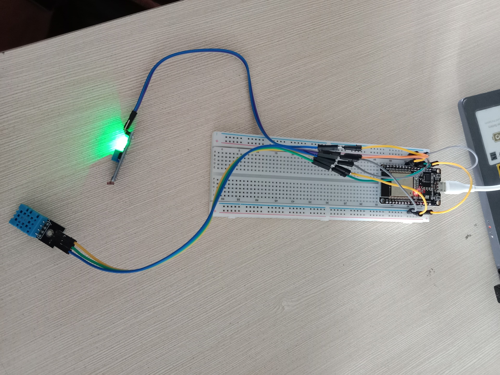
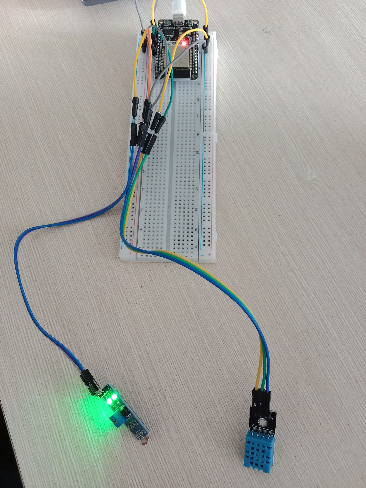
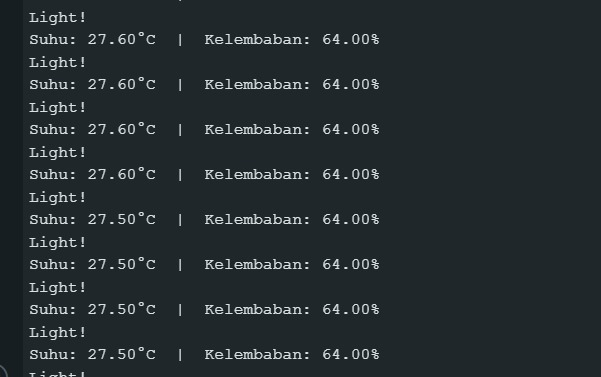

14/03/2025
# Anggota kelompok:

1. Ahmad Mumtaz Haris (2241720136/01)
2. Lucky Kurniawan Langoday (2241720168/12)
3. Muhammad Kemal Nugraha (2241720044/14)
4. Silfi Nazarina (2241720054/21)

# Sensor yang digunakan:
- DHT11 : Sensor suhu dan kelembapan
- LDR : Sensor cahaya

# Dokumentasi

**Rangkaian ESP32**

- Sensor DHT11 terhubung dengan pin 4 pada ESP32
- Sensor LDR terhubung dengan pin 5 pada ESP32

**Output**

- Pada praktikum ini kami mengetes perubahan nilai suhu dan kelembapan dari sensor DHT11 dengan menggenggam sensor.
- Untuk mengetes perubahan output sensor LDR kami mencoba mengarahkan sensor pada area gelap dan terang.
- Pada sensor LDR ada perubahan mati nyalanya lampu DO-LED pada sensor saat diarahkan ke area gelap karena kita menggunakan pin DO (Digital output).

